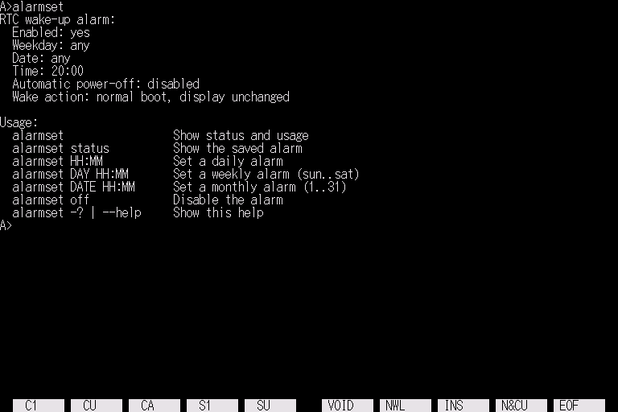

# alarmset

[English](README.md) | [日本語](README.ja.md)

<p align="center">
  
</p>

<p align="center">
  <strong><a href="https://uraraworks.github.io/WebX68k/?cpu=10&ram=12&fd1=https://raw.githubusercontent.com/renatus-novus-x/alarmset/main/dist/alarmset.zip&run=1">WebX68kでalarmsetを起動</a></strong>
</p>

Sharp X68000 / Human68k用の、RTCアラームによる予約電源オンを設定する
最小ユーティリティです。

## 使用方法

```text
alarmset                                      状態とusageを表示
alarmset status                               保存されているアラームを表示
alarmset HH:MM [--off-after MINUTES]          毎日のアラームを設定
alarmset DAY HH:MM [--off-after MINUTES]      毎週のアラームを設定
alarmset DATE HH:MM [--off-after MINUTES]     毎月のアラームを設定
alarmset off                                  アラームを無効化
alarmset -?                                   usageを表示
alarmset --help                               usageを表示
```

実行例:

```text
alarmset 07:30
alarmset 07:30 --off-after 60
alarmset mon 06:45 --off-after 30
alarmset 15 08:00
alarmset off
```

`--off-after MINUTES`を末尾に指定すると、RTCアラームで起動してから指定した
分数の経過後に自動で電源を切ります。MINUTESには正の10進整数を指定します。
このオプションを省略した場合、自動電源断は無効になります。

> [!CAUTION]
> RTC起動直後は`/RTC_ALARM`がまだアクティブな可能性があります。X68000の
> 電源断には`/RTC_ALARM`などの電源保持信号がすべて解除される必要があるため、
> 同じ分のうちに即座に`shutdown -h now`を実行すると、電源が落ちない可能性が
> あります。

X68000 ROM IOCSの`_ALARMMOD`、`_ALARMSET`、`_ALARMGET`を使用します。
新しい予約は通常ブート、テレビ制御なし、起動後の自動電源断なしで設定され、
バッテリーバックアップSRAMに保存されます。

設定後は背面の主電源を入れたまま、対応するソフト電源経路で本体を電源オフに
してください。RTC起動には、本体のRTC、待機電源、電源制御回路が正常に動作
している必要があります。交換電源やエミュレータでは挙動が異なる場合があります。
無人起動に用いる前に、時計とアラームの状態を確認してください。

生成したディスクイメージは、Human68k起動後に`AUTOEXEC.BAT`から引数なしで
`alarmset.x`を実行します。この動作は状態とusageを表示するだけで、設定を変更
しません。

## ビルド

elf2x68kを導入し、`m68k-xelf-gcc`に`PATH`が通ったWSLまたはLinux環境で
ビルドします。

必要なホストツールをインストールします。

```sh
sudo apt install python3 curl unar
```

リポジトリ直下から`src`へ移動して実行します。

```sh
cd src
make
```

MakefileはHuman68k 3.02とバージョンを固定した`xdftool.py`をダウンロードし、
次のファイルを作成します。

```text
src/alarmset.x     Human68k実行ファイル
src/alarmset.xdf   起動可能なHuman68kディスクイメージ
dist/alarmset.zip  Human68k許諾条件を含む配布用アーカイブ
```

生成したディスクイメージの内容を確認する場合は次を実行します。

```sh
make check-xdf
```

生成ファイルは`make clean`で削除できます。ダウンロードした補助ファイルも
削除する場合は`make distclean`を使用します。
